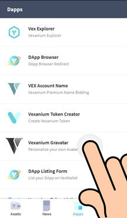
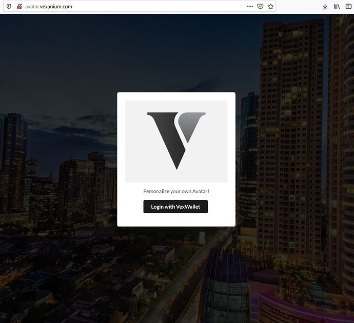
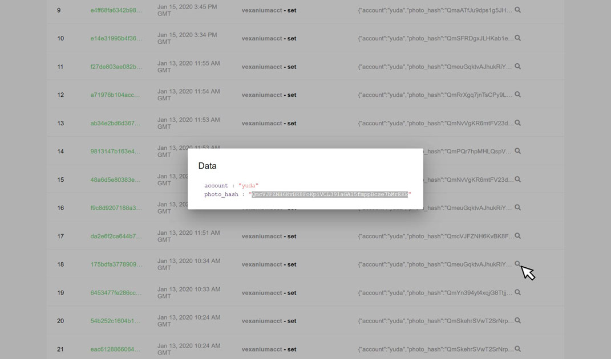

# Gravatar
[DApp](https://github.com/vexanium/DApps) for storing Avatars by utilizing [IPFS](https://ipfs.io/) developed using [ReactJS](https://reactjs.org/)  
Credit by **Damos Anggara**, [trusti.id](https://trusti.id/)

## Installation
Below the step by step installation procedure to activate the FrontEnd App
1. **Clone** this repository  
   ```git clone https://github.com/vexanium/Gravatar.git```  
2. Go to **frontend directory**  
   ```cd /{placeyouput}/Gravatar/frontend```  
3. Change the **port (optional)**  
   By default ReactJS will use port **3000**, if you don't mind with it, skip this and go to next step.  
   Otherwise, open and edit [package.json](frontend/package.json) on your server, change the "start" option into something like this:
   ```js
   "scripts": {
      "start": "PORT=2000 react-scripts start",
      "build": "react-scripts build",
      "test": "react-scripts test --env=jsdom",
      "eject": "react-scripts eject"
   },
   ```    
   > The example above is setting the port into 2000.  
       
5. **Install** and be patient for it   
   ```npm install```  
   >  As it's developed using ReactJS, you need to be connected to the internet, and patiently wait for it to download and setup all dependencies  
6. **Start** the app   
   ```npm start &```  
7. **Run** it on your favourite browser  
   ```http://localhost:2000/```

## Smart Contract
This app is using [vexaniumacct](https://explorer.vexanium.com/account/vexaniumacct) smart contract  
You can find the setup at [frontend/src/config/default.js](frontend/src/config/default.js)  
And if you want to learn the smart contract, you can brush up on [smartcontract/accountphoto.cpp](smartcontract/accountphoto.cpp)   
### Compiling the smart contract:  
```cpp
eosio-cpp accountphoto.cpp -o accountphoto.wasm
```  
> Please read our [Technical Documentation](http://dev.vexanium.com/tutorial) for this  

### Publishing the smart contract
You can publish the smart contract to your own Vexanium Account, for example: **yourownaccnt**  
```bash
./cleos --url http://209.97.162.124:8080 set contract yourownaccnt /dir/youput/contracts/accountphoto -p yourownaccnt@active
```  
Then edit [frontend/src/config/default.js](frontend/src/config/default.js), change into:  
```js
"contract": "yourownaccnt"
```  
Re[start](#Installation) the app

## Live Showcase
This DApp can be accessed via VexWalletAndroid as follow:    
  
or on Win/Mac Desktop via browser:  
[http://avatar.vexanium.com/](http://avatar.vexanium.com/)  
  
> Open your Win/Mac VexWallet first then you can login to this DApp  

Your avatar will be uploaded to IPFS, the transaction will be recorded to our blockchain.  
Here how you can check the output:  
Check the transaction at ```https://explorer.vexanium.com/account/{yourvexaccount}```  
You will see something just like this:  
  
Click on the magnifying glass icon, then copy the **photo_hash value**, as in this example it is ```QmcVJFZNH6KvBK8FoKpiVCL391aGA15fmppBcse7bMrEKk```  
After that, you can view your uploaded image by pasting the hash to IPFS url
```https://cloudflare-ipfs.com/ipfs/{your_photo_hash}```  

In this example, it's [https://cloudflare-ipfs.com/ipfs/QmcVJFZNH6KvBK8FoKpiVCL391aGA15fmppBcse7bMrEKk](https://cloudflare-ipfs.com/ipfs/QmcVJFZNH6KvBK8FoKpiVCL391aGA15fmppBcse7bMrEKk)  
You can use this link for photo sharing, image resource for your website, or just storing it as an online backup, simply said, for anything you want. 
